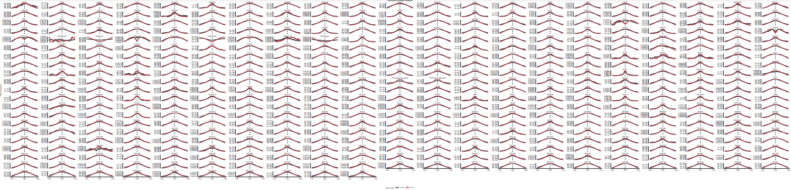
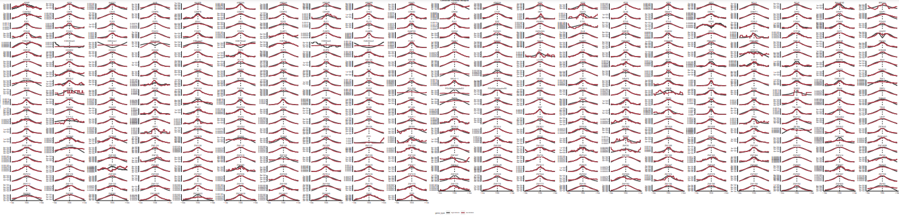

# Your mission should you choose to accept it 
There is an enormous amount of data in ENCODE that 
needs to be analyzed. This includes 480 unique DBP
ChIPseq datasets. To facilitate your mission we provide you
1,066 peak files that have been run through the NF_CORE chipseq
pipeline. 


```r
load("01_peaks/results/peak_features.RData", verbose = T)
load("01_peaks/results/peak_features2.RData", verbose = T)
load("04_RNAseq/results/nuc_cyto.RData", verbose = T)
```

# First I analyze the large data for general properties 

```r
# Any chip data less 1,000 peaks was filtered out

# How does peak number and genome coverage compare
knitr::include_graphics("01_peaks/figures/peak_number_vs_coverage.pdf")
```


```r
# What is the distribution of promoter overlaps versus gene-bodies (hint hist)
knitr::include_graphics("01_peaks/figures/peak_distribution.pdf")
```

<!-- -->

```r
# Make a list of genes that are "super binders" 
super_binders <- peak_occurence_df[peak_occurence_df$number_of_dbp > 200,]

# Is there a type of gene ontology associated with them versus the others?
cat("Most of the super binders are associated with mRNA")
```

```
## Most of the super binders are associated with mRNA
```

```r
# Is there a difference in mRNA and lncRNA promoter overlaps?
cat(paste0("Number of lncRNA super binders: ", 
           nrow(super_binders %>% filter(gene_type=="lncRNA")), 
           "\n",
           "Number of mRNA super binders: ", 
           nrow(super_binders %>% filter(gene_type=="protein_coding"))))
```

```
## Number of lncRNA super binders: 2512
## Number of mRNA super binders: 9177
```

```r
# Do lncRNAs also have super-binding promoters?
cat("Yes, about 21.5% of the super-binding promoters are associated with lncRNAs")
```

```
## Yes, about 21.5% of the super-binding promoters are associated with lncRNAs
```

```r
# How many of these proteins are TFs? What is the most represented type of DBD?
supers <- human_tfs_full %>%
  filter(ID %in% sub("\\..*", "", super_binders$gene_id),
         tf == "Yes")

cat(paste0("Number of TFs: ", 
           nrow(supers %>% filter(tf=="Yes")), 
           "\n",
           "Most represented type of DBD: ", 
           names(which.max(table(supers$DBD)))))
```

```
## Number of TFs: 811
## Most represented type of DBD: C2H2 ZF
```
# Results
Peak number and genome coverage have a linear relationship

There is a larger distribution of peaks overlapping gene bodies compared to promoters

Super-binders are more associated with mRNAs

I found 9,177 mRNA superbinding promoters and 2512 lncRNA super-promoters

21.5% of super-binding promoters are associated with lncRNAs

811 of the proteins are TFs and the most represented DBD is C2H2 ZF

# Clustering - how similar our genes are to each other

```r
# What genes make sense to cluster together create an image (hint Pol II makes RNA)
cat("Genes that make sense to cluster together are ones associated with either lncRNA or mRNA", 
    "as they are more likely to have similar functions. It also makes sense to cluster genes", 
    "that may be in the same pathway to see if they are related to each other.")
```

```
## Genes that make sense to cluster together are ones associated with either lncRNA or mRNA as they are more likely to have similar functions. It also makes sense to cluster genes that may be in the same pathway to see if they are related to each other.
```

```r
# Find a cluster of genes your interested in and can figure out what those genes do -- are there unknown genes in there too? If so maybe one could hypothesize they have a similar function to the known genes (Hint ZNFs)
knitr::include_graphics("02_clustering/figures/dbp_hclust_dendro.pdf")
```

<!-- -->

```r
cat(paste0("Gene Cluster: NRL, ZNF280B",
           "\n",
           "ZNF280B appears to be similar to gene NRL and may be involved in photorecptor development/function"))
```

```
## Gene Cluster: NRL, ZNF280B
## ZNF280B appears to be similar to gene NRL and may be involved in photorecptor development/function
```

```r
# if we cluster by lncRNA and mRNA separately what are some similarities and differences?
knitr::include_graphics("02_clustering/figures/lncrna_hclust_binary_dist.pdf")
```

<!-- -->

```r
knitr::include_graphics("02_clustering/figures/mrna_hclust_binary_dist.pdf")
```

<!-- -->

```r
cat(paste0("Similarities: similar amount of genes closely clustered, some genes tightly clustered in both (FOXA1/2)",
           "\n",
           "Differences: different overall shape of plot, some genes clustered differently (YEATS2)"))
```

```
## Similarities: similar amount of genes closely clustered, some genes tightly clustered in both (FOXA1/2)
## Differences: different overall shape of plot, some genes clustered differently (YEATS2)
```
# Results
ZNF280B appears to be similar to gene NRL and may be involved in photoreceptor development/function

# Metaplots

```r
# Let's look at the metaplot for all DBPs on lncRNA and mRNA promoters seperately (hint facet wrap).

```


```r
# Which genes seem to have a difference in where they bind on promoters between lncRNA and mRNA promoters
cat("H3K4me1, H3K4me2, H3K79me2, H4K20me1, EZH2")
```

```
## H3K4me1, H3K4me2, H3K79me2, H4K20me1, EZH2
```

```r
# Make a metaplot of DBPS only on Super-binders versus regular promoters

```


```r
cat("Super-binders are more distributed")
```

```
## Super-binders are more distributed
```
# Results
H3K4me1, H3K4me2, H3K79me2, H4K20me1, and EZH2 bind differently on lncRNA and mRNA promoters

DBPs on super-binders tend to be more distributed than on regular promoters

# RNAseq expression

```r
# What is the relationship between number of DBPS bound on a promoter versus RNA output (hint TPM)
knitr::include_graphics("04_RNAseq/figures/Expression_vs_DBP_promoter_binding.pdf")
```

<!-- -->

```r
# Let's make a heatmap of genes that are variable across samples 
knitr::include_graphics("04_RNAseq/figures/all_vs_total_genes_heatmap.pdf")
```

<!-- -->

```r
# Which subfraction of the cell has the highest expression.
cat("The nuclear subfraction of the cell has the highest expression")
```

```
## The nuclear subfraction of the cell has the highest expression
```

```r
# Let's make a heatmap of nuclear versus cytoplasmic expression
knitr::include_graphics("04_RNAseq/figures/nuc_vs_cyto_genes_heatmap.pdf")
```

<!-- -->

```r
# How many lncRNA and mRNA genes are sig in nuclear or cyto
cat(paste0("Significant lncRNA Nuclear Genes: ", nrow(lncrna_nuc_sig), "\n",
           "Significant mRNA Nuclear Genes: ", nrow(mrna_nuc_sig), "\n",
           "Significant lncRNA Cytosolic Genes: ", nrow(lncrna_cyto_sig), "\n",
           "Significant mRNA Cytosolic Genes: ", nrow(mrna_cyto_sig)))
```

```
## Significant lncRNA Nuclear Genes: 2115
## Significant mRNA Nuclear Genes: 2559
## Significant lncRNA Cytosolic Genes: 917
## Significant mRNA Cytosolic Genes: 3499
```

```r
# What is/are the most nuclear mRNA(s) -- is there a type of gene ontology associated with them?
nuc_mrnas <- nuc_cyto_sig_genes %>%
  filter(gene_id %in% mrna_nuc_sig$gene_id)
nuc_mrnas[order(nuc_mrnas$log2FoldChange)[1:10],]$gene_name
```

```
##  [1] "MT-CO2"  "MT-ND2"  "MT-ND1"  "MT-ND6"  "MT-ND3"  "MT-ND5"  "MT-ATP8"
##  [8] "MT-ND6"  "MT-CYB"  "MT-CO1"
```

```r
print("The most nuclear mRNAs are mitochondrial genes")
```

```
## [1] "The most nuclear mRNAs are mitochondrial genes"
```

```r
# If we zoom in on high binding promoters (> 200 DBPs) are there any that don't have any expression?
cat("Yes,", nrow(promoter_features_df %>% 
       filter(hepg2_reservoir == 1)), "reservoirs were found")
```

```
## Yes, 168 reservoirs were found
```
# Results
There is a linear relationship between RNA expression and DBPs bound

The nuclear subfraction of the cell has the highest expression

The most nuclear mRNAs are mitochondrial genes

in 04_RNAseq/results/reservoirs.csv I have all the super binders that don't express RNA


